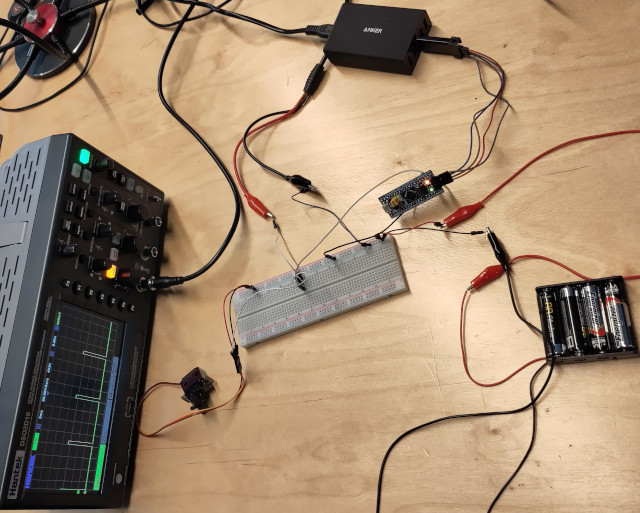

# Servo demo

A demo of controlling RC servos from Rust.

We have two different servos to show, a small MG90s, and a larger 6221MG. These
are both RC servos, and are controlled in exactly the same way.


## What *are* servos?

Servos rotate to set angles based on the signal we send. The demo is going to
move the servos through a 120 or 180 degree movement depending on the servo we
select.

The servo is made up of a small electric motor, a gearbox to lower the speed
and increase the torque, a potentiometer connected to the output shaft, and
some control electronics which interpret the signal to control the motor so
that the desired output shaft angle is achieved. The output shaft potentiometer
is how the servo can know what angle it's achieved vs what's been requested.

On the drive shaft are optional attachments known as "servo horns", that make
it easy to attach the servo to the thing you'd like to move. The servo shaft
also accepts a screw through its center as another way of attaching it to
things.


# The servos

We have two different servos. The immediately obvious difference is that the
6221MG is larger than the MG90s. It's also nearly 10x as powerful - see the
"stall torque" numbers below. Another difference is that the smaller servo
moves through 180 degrees, and the larger through 120 degrees (60 degrees
either side of neutral).

The commonality is that they're both "RC" (radio control) servos, which is a
common type of hobby servo. There are other types, with different control
schemes, but these are both easy to get and cheap.


## MG90s

<a href="images/mg90s_large.jpg"></a>


[Data Sheet](https://datasheetspdf.com/pdf/1106582/ETC/MG90S/1)

Period of 20ms, and a duty cycle of 1-2ms.  Rotates 90deg in each direction -
180deg in total.

* Weight: 13.4 g
* Dimension: 22.5 x 12 x 35.5 mm approx
* Stall torque: 1.8 kgf·cm (4.8V ), 2.2 kgf·cm (6 V)
* Operating speed: 0.1 s/60 degree  (4.8 V), 0.08 s/60 degree (6 V)
* Operating voltage: 4.8 V - 6.0 V
* Dead band width: 5 μs


## PDI-6221MG

<a href="images/pdi6221mg_large.jpg"></a>


[Link](https://www.rcgoing.com/jx-pdi-6221mg-20kg-large-torque-digital-standard-servo-360-degree-cw/)

Period of 20ms, and duty cycle of 1-2ms. Rotates 60deg in each direction -
120deg total.

    Model No: PDI-6221MG
    Voltage: 4.8~6V
    Stall Torque (4.8V): 17.25kg
    Stall Torque (6.0V): 20.32kg
    Speed (4.8V): 0.18sec/60°
    Speed (6.0V): 0.16sec/60°
    Dead Band: 2µs 1520µ/330hz
    Motor: Std cored
    Gears: Metal
    Spline Count: 25T
    Bearing: 2BB
    Dimensions: 40.5 x 20.2 x 38mm
    Weight: 62g
    Connector: JR type
    Servo Wire Length: 265mm


A note on the stall torque and operating speed. Using this servo as an example,
it says that at 4.8V, it can turn the output shaft 60 degrees in 0.18 seconds.
When doing so - it can lift up to a 17.25kg weight that is attached at a radius
of 1cm from the center of the output shaft.


# Connecting a servo

The servo connectivity is through three wires that are terminated with a set of
0.1" jacks. The order of the jacks is commonly signal, voltage, ground and are
also color coded. There are two differnet schemes:

* black, red, white
* brown, red, yellow/orange

where:

* brown or black is ground.
* red is servo power.
* white, yellow, or orange is signal.

Power is commonly 4.8V, but as you can see from the specifications above, many
accept a range of voltages, and they're even able to deal with lower voltages
than specified for the control signal. For example, we'll give the control
signal at 3.3V, and you'll be able to still see the servo respond.

We'll power the board from a different power supply than the servo. The servo
is getting 6V from a battery pack, and the microcontroller 3.3V from the
St-link programmer (it can also be powered with either 3.3V or 5V on one of the
pins marked accordingly).

The end result should look like this:

<a href="images/stm32_setup_large.jpg"></a>

This is the same as a drawing:
<a href="images/stm32_servo_bb.png"></a>

And the same as a schematic:
<a href="images/stm32_servo_schem.png"></a>

Note that while the microcontroller can also *output* either 3.3V or 5V on
those pins, they won't provide enough current to move the servo, and trying to
do so can damage the microcontroller board.


# Controlling the servo

The servo expects to receive a pulse each 20ms (so a 50hz signal), where the
width of the pulse determines the position of the output shaft. At a 1ms width,
the servo is at one extreme, and at 2ms it is at the opposite extreme. At
1.5ms, the servo is at its neutral (middle) position.

The signal is expected to be at 4.8V, but most servos will happily consume
3.3V, all the way up to its maximum operating voltage.


# Our setup 

We connect the:

* battery pack's ground to the black or blue power rail on the breadboard.
* servo's power lead (red) to the battery pack's 6V output.
* servo's ground lead (black or brown) to the common ground on the breadboard.
* servo's signal lead (white, yellow, or orange) to a row on the breadboard.
* microcontroller's pin PA0 to the same row on the breadboard as the servo
  signal lead.
* microcontroller's SWD pins to the ST-link V2 programmer.
* oscilloscope's ground probe to the breadboards's ground rail.
* oscilloscope's signal probe to the same row on the breadboard as the servo
  signal lead.

We have connected up the oscilloscope so that we can visualise the servo
signal.

NOTE: The PWM pin we have selected is PA0 on the blue pill microcontroller
board. The PWM output is 3.3V, so below the 4.8V that the servo is expecting,
but as you'll see, it works fine.


# Other kinds of servos

Other servos may operate at different voltages, have control schemes where the
position can be read back, or even have programmable movement profiles.

There are also contiously rotating servos, and servos which respond to just the
%age time the signal is active, rather than the 50hz signal that these RC
servos use.


# Running the demos

## stm32 and rust

### Setup

To prepare - go to https://rustup.rs/ and follow the instructions to get Rust
installed.

Add the cross-compilation target for the microcontroller:

    rustup target add thumbv7m-none-eabi

Install `probe-rs`'s dependencies with

    sudo apt install -y libusb-1.0-0-dev libftdi1-dev libudev-dev

and then `probe-rs` itself with

    cargo install probe-run

Set up the `udev` rules so that you can access the st-link programmer without
having to use `sudo` or being the root user. Create the file
`/etc/udev/rules.d/70-st-link.rules` and add the contents:

    # STM32F3DISCOVERY rev A/B - ST-LINK/V2
    ATTRS{idVendor}=="0483", ATTRS{idProduct}=="3748", TAG+="uaccess"

    # STM32F3DISCOVERY rev C+ - ST-LINK/V2-1
    ATTRS{idVendor}=="0483", ATTRS{idProduct}=="374b", TAG+="uaccess"

Reload all the `udev` rules with:

    sudo udevadm control --reload-rules

Then plug in the St-Link V2 programmer.


### Build, and flash the code

We flash the code onto the blue pill with `cargo run`, which will invoke the
`probe-run` launcher, part of the probe.rs toolchain. This is configured via
Cargo, the Rust package manager and build system. See
`demo_stm32_rust/.cargo/config`.

Note that `probe-run` also connects the debugger, so we'll be able to get debug
prints and even stack traces from the code.

Once flashed of course, the microcontroller operates without needing the
programmer. We only use it to power the board after the first flash.

You'll see the servo move between its two extremes continuousy. You'll also be
able to see the control signal on the oscilloscope - and you can see what
signal corresponds to what angle of the servo.


### probe-run

The `probe-run` configuration, and some other building and linking information
is in the `.cargo/config` file - you can take a look in there, it is well
commented. More information on `probe-run` can be found at
[probe-run](https://github.com/knurling-rs/probe-run), from the excellent
Knurling project - it uses tooling from [probe.rs](https://probe.rs/).

If you run `cargo build`, `probe-run` won't be built - only the binary which
would have ended up on the microcontroller. You can built it and take a look at it:

```
❯ file target/thumbv7m-none-eabi/debug/servo_demo
target/thumbv7m-none-eabi/debug/servo_demo: ELF 32-bit LSB executable, ARM, EABI5 version 1 (SYSV), statically linked, with debug_info, not stripped
```


## arduino nano and c++


## Micro:bit and python


https://python.microbit.org/v/beta


```python
from microbit import * 
# Servo control: 
# 50 = ~1 millisecond pulse all right 
# 75 = ~1.5 millisecond pulse center 
# 100 = ~2.0 millisecond pulse all left 
pin0.set_analog_period(20)

while True: 
	pin0.write_analog(75)
	sleep(1000)
	pin0.write_analog(50)
	sleep(1000)
	pin0.write_analog(100)
	sleep(1000)
```


# Licenses


Images and text licensed under a <a rel="license"
href="http://creativecommons.org/licenses/by-sa/4.0/">Creative Commons
Attribution-ShareAlike 4.0 International License</a>.
<a rel="license" href="http://creativecommons.org/licenses/by-sa/4.0/"></a>
